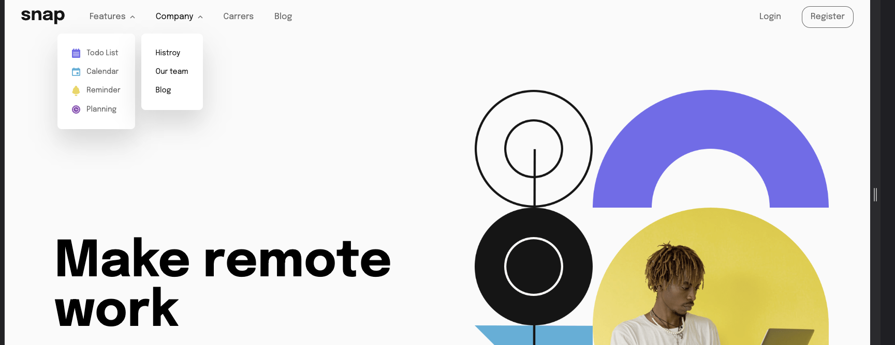
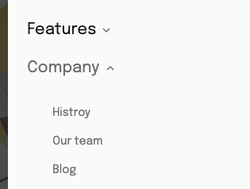
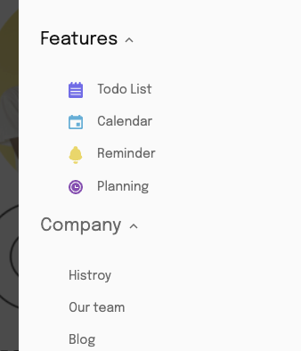

# Frontend Mentor - Intro section with dropdown navigation solution

This is a solution to the [Intro section with dropdown navigation challenge on Frontend Mentor](https://www.frontendmentor.io/challenges/intro-section-with-dropdown-navigation-ryaPetHE5). Frontend Mentor challenges help you improve your coding skills by building realistic projects.

## Table of contents

- [Overview](#overview)
  - [The challenge](#the-challenge)
  - [Screenshot](#screenshot)
  - [Links](#links)
- [My process](#my-process)
  - [Built with](#built-with)
  - [What I learned](#what-i-learned)
  - [Useful resources](#useful-resources)
- [Author](#author)


## Overview

### The challenge

Users should be able to:

- View the relevant dropdown menus on desktop and mobile when interacting with the navigation links
- View the optimal layout for the content depending on their device's screen size
- See hover states for all interactive elements on the page

### Screenshot








### Links

- Solution URL: [https://github.com/EthanChenYen-Peng/frontend-pratice-Intro-section-with-dropdown-navigation](https://github.com/EthanChenYen-Peng/frontend-pratice-Intro-section-with-dropdown-navigation)
- Live Site URL: [https://frontend-pratice-intro-section-with-dropdown-navigation.vercel.app/](https://frontend-pratice-intro-section-with-dropdown-navigation.vercel.app/)

## My process

### Built with

- Flexbox
- Mobile-first workflow
- [React](https://reactjs.org/) - JS library
- [TailwindCSS](https://tailwindcss.com/) - For styles


### What I learned

The trickiest bit of the project is the dropdown menu in the mobile navbar.

Given that links and content within each dropdown menu are more likely to change, separating the data source from its presentation makes sense.

Here I extracted the data source into its own module, `src/utils/navlinks.js`, which is used in both mobile and desktop navbar.
```js
import todoIcon from '../../images/icon-todo.svg'
import calendarIcon from '../../images/icon-calendar.svg'
import reminderIcon from '../../images/icon-reminders.svg'
import planningIcon from '../../images/icon-planning.svg'

export const featuresNavLinks = [
  [todoIcon, 'Todo List'],
  [calendarIcon, 'Calendar'],
  [reminderIcon, 'Reminder'],
  [planningIcon, 'Planning'],
]

export const companyNavLinks = ['Histroy', 'Our team', 'Blog']
```

I attempted the render props pattern to build the dropdown menu container for better component reuse.

`MobileDropdownLink`: is responsible for animation and handling user events (open and close).
`CompanyLinks` and `FeatureDropdownLinks` : are responsible for presenting navigation links.
```jsx
import { companyNavLinks, featuresNavLinks } from '../utils/navlinks'
import MobileDropdownLink from './MobileDropdownLink'
function FeatureDropdownLinks() {
  return (
    <>
      {featuresNavLinks.map(([icon, item]) => (
        <li key={item} className="flex min-w-max items-center gap-4 pl-8">
          
          <span className="text-sm font-thin">{item}</span>
        </li>
      ))}
    </>
  )
}

function CompanyLinks() {
  return (
    <>
      {companyNavLinks.map((item) => (
        <li key={item} className="flex min-w-max items-center gap-4 pl-8">
          <span className="text-sm font-thin">{item}</span>
        </li>
      ))}
    </>
  )
}

function MobileOverlay({ menuOpen }) {
  return (
    <div
      className={`${
        menuOpen ? 'translate-x-0' : 'translate-x-full'
      } fixed top-0 bottom-0 right-0 left-0 bg-almost-black opacity-80 transition-transform duration-500 ease-in-out desktop:hidden`}
    ></div>
  )
}

function MobileMenu({ menuOpen }) {
  return (
    <>
      <MobileOverlay menuOpen={menuOpen} />
      <div
        className={`${
          menuOpen ? 'translate-x-0' : 'translate-x-full'
        } fixed top-0 bottom-0 right-0 w-8/12 bg-almost-white px-6 transition-transform duration-500 desktop:hidden`}
      >
        <ul className="mt-32 flex flex-col gap-5 text-xl text-medium-gray">
          <MobileDropdownLink
            title="Features"
            render={() => <FeatureDropdownLinks />}
          />
          <MobileDropdownLink title="Company" render={() => <CompanyLinks />} />
          <li>Careers</li>
          <li>About</li>
        </ul>

        <ul className="mt-10 flex flex-col items-center gap-5 text-medium-gray">
          <li>Login</li>
          <li className="rounded-2xl border-2 py-2 px-7">Register</li>
        </ul>
      </div>
    </>
  )
}

export default MobileMenu
```


### Useful resources

- [https://tailwindcss.com/docs/configuration](https://tailwindcss.com/docs/configuration) - This helped me with configure custom color theme and breakpoints when using TailwindCSS.
- [https://www.patterns.dev/posts/render-props-pattern/](https://www.patterns.dev/posts/render-props-pattern/) - More about `render props` pattern.

## Author

- Website - [https://www.ypcethan.com/](https://www.ypcethan.com/)
- Frontend Mentor - [https://www.frontendmentor.io/profile/EthanChenYen-Peng](https://www.frontendmentor.io/profile/EthanChenYen-Peng)

